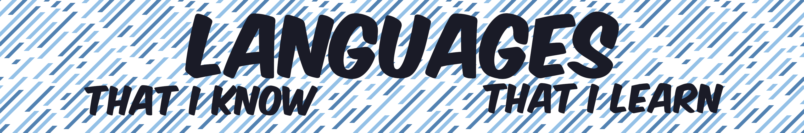

    

 

<!-- PHP -->

<!-- HTML -->

<!-- CSS -->

<!-- JAVA -->

<!-- JS -->

<!-- Node -->

<!-- MD -->

<!-- P5.JS -->

<!-- GIT -->

<!-- Apache -->

<!-- Linux -->

<!-- Ubuntu -->

<!-- NGINX -->

<!-- MariaDB -->

<!-- MySQL -->

    

 

    

 

