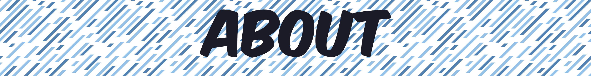
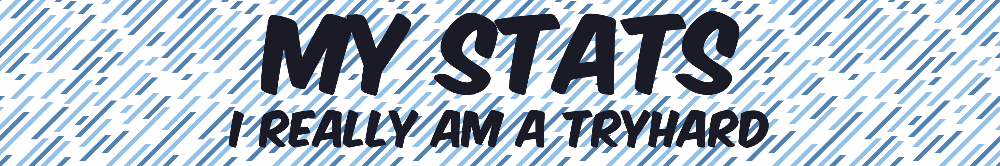

  <h3 width="40%">Hello 👋. I'm Nevah5. I'm an apprentice as a software engineer in Zurich Switzerland. I'm currently working on small private projects to gain more experience in programming. My goals are to contribute to larger projects soon.</h3>

 
 

    

   

     

